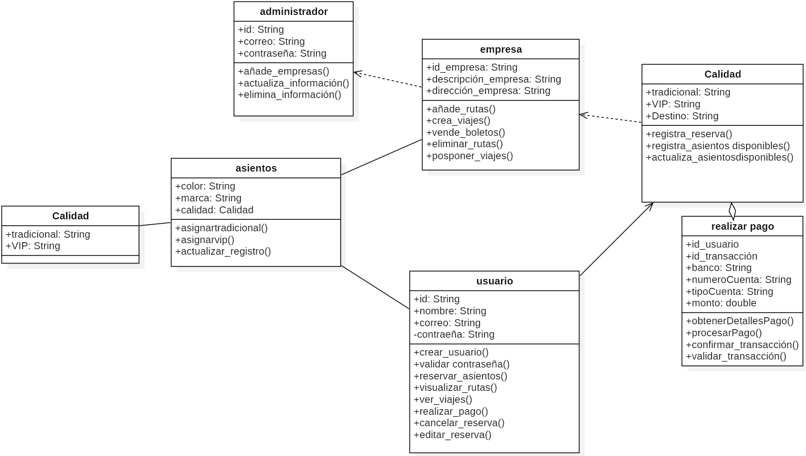
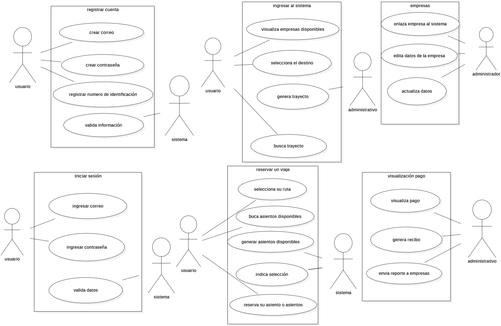

# Reservayapps

Proyecto realizado por:

- Andres Felipe Hernandez
- Carlos Morales Estrada
- Daniel Alejandro Acosta Cajas
- Marly Zulay Cardoso

[Enlace del documento word con documentación](https://laiberocol-my.sharepoint.com/:w:/g/personal/cmoral49_estudiante_ibero_edu_co/EblatmbgIl5OsyUqi7UgdP8BdVbT_1RkbuIutzR1wsJw2Q?e=n8t6Jl)

## Nombre del proyecto (Deben dar un nombre a su proyecto)

Reservayapps

## Método de construcción de software que utilizará

Utilizaremos la metodología **SCRUM** junto a **KANBAN** para gestionar las historias de usuario y asignarlas a cada miembro del equipo.

## Explicación de por qué se utiliza ese método

Elegimos este método para tener una ágil entrega y retroalimentación constante con el cliente final para realizar los ajustes necesarios. También porque nos ayudará a tener un control y seguimiento de las cargas de trabajo y los esfuerzos del equipo.

## Introducción

El proyecto **"Reservayapps"** fue concebido como una iniciativa a corto plazo con el objetivo de crear una plataforma web que no solo cumpliera con los requisitos básicos de reservas de pasajes, sino que también ofreciera una experiencia diferenciada frente a las aplicaciones ya existentes. A través de esta plataforma, los usuarios pueden reservar pasajes de autobús de diversas empresas de transporte en un solo lugar, brindando una mayor comodidad y accesibilidad.

Una de las características distintivas de **"Reservayapps"** es la posibilidad de elegir entre un servicio tradicional o uno VIP, adaptándose a las preferencias y necesidades de cada viajero. Este enfoque busca destacar en el mercado al ofrecer una solución intuitiva y moderna, con opciones personalizadas tanto para los gustos como para los presupuestos de los usuarios.

El objetivo principal del proyecto es proporcionar una experiencia de usuario fluida y completa, abarcando desde la reserva inicial hasta la personalización de cada aspecto del viaje.

## Objetivo

Nuestro objetivo es simplificar el proceso de compra de boletos, ofreciendo a los usuarios una plataforma accesible que les permita buscar y reservar asientos de manera práctica, desde cualquier lugar y en cualquier momento. La aplicación proporcionará información detallada y actualizada sobre horarios, disponibilidad y precios, asegurando una experiencia clara y eficiente. Además, garantizamos un proceso de pago seguro que protege la información personal de los usuarios, incrementando su confianza y satisfacción al utilizar la aplicación.

## Diagrama de Clases

## Diagrama de Casos de Uso

## Atributos de la Clase **Administrador**

- **id**: identificador único del administrador.
- **correo**: correo electrónico del administrador.
- **contraseña**: contraseña del administrador.

## Atributos de la Clase **Empresa**

- **id_empresa**: identificador único de la empresa.
- **descripción_empresa**: descripción general de la empresa.
- **dirección_empresa**: dirección física de la empresa.

## Atributos de la Clase **Usuario**

- **id**: identificador único del usuario.
- **nombre**: nombre completo del usuario.
- **correo**: correo electrónico del usuario.
- **contraseña**: contraseña del usuario.

## Atributos de la Clase **Asientos**

- **color**: color del asiento.
- **marca**: fabricante o marca del asiento.
- **calidad**: calidad del asiento, que puede ser una de las instancias de la clase "Calidad".

## Atributos de la Clase **Calidad**

- **tradicional**: categoría de asientos tradicionales.
- **VIP**: categoría de asientos VIP.
- **Destino**: destino de los asientos.

## Atributos de la Clase **Realizar Pago**

- **id_usuario**: identificador único del usuario que realiza el pago.
- **id_transaccion**: identificador único de la transacción.
- **banco**: banco asociado al pago.
- **numeroCuenta**: número de cuenta asociado al pago.
- **tipoCuenta**: tipo de cuenta utilizada para el pago.
- **monto**: monto total de la transacción.
